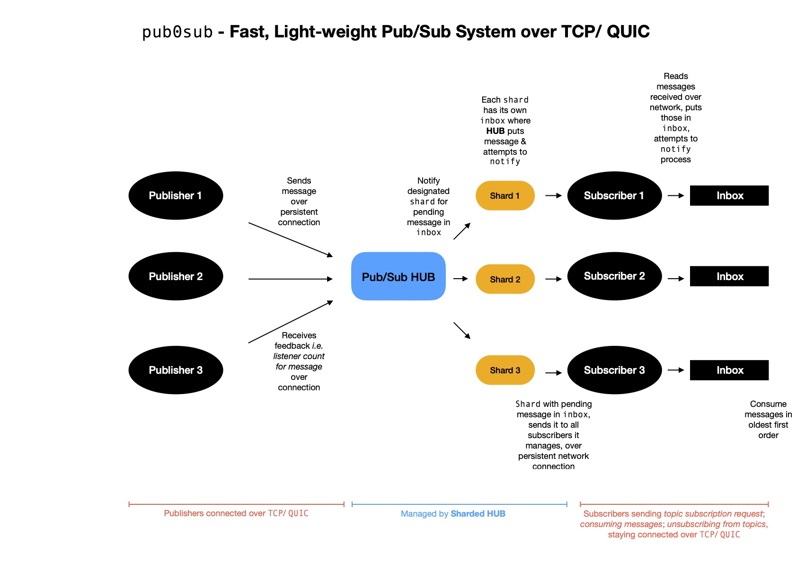

# pub0sub
Fast, Lightweight Pub/Sub over TCP, QUIC

## Motivation

Few days back I worked on an _Embeddable, Fast, Light-weight Pub/Sub System for Go Projects_, called `pubsub`, which is built only using native Go functionalities & as the title suggests, you can embed that system in your application for doing in-app message passing using any of following patterns

- Single Publisher Single Subscriber
- Single Publisher Multiple Subscriber
- Multiple Publisher Single Subscriber
- Multiple Publisher Multiple Subscriber

That enables making multiple go routines talk to each other over **topics**. Also there's no involvement of network I/O, so all operations are quite low-latency.

> If you're interested in taking a look at [`pubsub`](https://github.com/itzmeanjan/pubsub)

Now I'm interested in extending aforementioned `pubsub` architecture to a more generic form so that clients i.e. _{publishers, subscribers}_ can talk to **Pub/Sub Hub** over network i.e. TCP, QUIC.

What it gives us is, ability to publish messages to topics over network, where **Pub/Sub Hub** might sit somewhere else; subscribe to topics of interest & keep receiving messages as soon as they're published, over network.

> QUIC to be preferred choice of network I/O, due to benefits it brings on table.

> ⭐️ Primary implementation is on top of TCP.

## Architecture



## Install

Add `pub0sub` into your project _( **GOMOD** enabled )_

```bash
go get -u github.com/itzmeanjan/pub0sub
```

## Usage

`pub0sub` has three components

- [Hub](#hub)
- [Publisher](#publisher)
- [Subscriber](#subscriber)

### Hub

You probably would like to use `0hub` for this purpose.

---
Default Port | Default Interface
--- | ---
13000 | 127.0.0.1
---

Build using 

```bash
make build_hub
```

Run using

```bash
./0hub -help
./0hub # run
```

> Single step build-and-run with `make hub`

> If interested, you can check `0hub` implementation [here](./cli/hub/0hub.go)

### Publisher

You can interact with Hub, using minimalistic publisher CLI client `0pub`. Implementation can be found [here](./cli/publisher/0pub.go)

Build using

```bash
make build_pub
```

Run using

```bash
./0pub -help
./0pub # run
```

> Single step build-and-run with `make pub`, using defaults

You're probably interested in publishing messages programmatically. 

- Let's first create a publisher, which will establish TCP connection with Hub

```go
ctx, cancel := context.WithCancel(context.Background())

pub, err := publisher.New(ctx, "tcp", "127.0.0.1:13000")
if err != nil {
	return
}
```

- Construct message you want to publish

```go
data := []byte("hello")
topics := []string{"topic_1", "topic_2"}

msg := ops.Msg{Topics: topics, Data: data}
```

- Publish message

```go
n, err := pub.Publish(&msg)
if err != nil {
	return
}

log.Printf("Approximate %d receiver(s)\n", n)
```

- When done using publisher instance, cancel context, which will tear down network connection gracefully

```go
cancel()
<-time.After(time.Second) // just wait a second
```

- You can always check whether network connection with Hub in unaffected or not

```go
if pub.Connected() {
    log.Println("Yes, still connected")
}
```

### Subscriber

You're encouraged to first test out `0sub` - minimalistic CLI subscriber client for interacting with Hub.

Build using

```bash
make build_sub
```

Run using

```bash
./0sub -help
./0sub # run
```

Take a look at implementation [here](./cli/subscriber/0sub.go)

> Single step build-and-run using `make sub`, runs with default config

But probably you want to programmatically interact with Hub for subscribing to topics of interest & receive messages as soon as they're published


- Start by creating subscriber instance, which will establish a long-lived TCP connection with Hub & subscribe initially to topics provided with

```go
ctx, cancel := context.WithCancel(context.Background())

capacity := 128 // pending message inbox capacity
topics := []string{"topic_1", "topic_2"}

sub, err := subscriber.New(ctx, "tcp", "127.0.0.1:13000", capacity, topics...)
if err != nil {
	return
}
```

- As soon as new message is available for consumption **( queued in inbox )**, subscriber process to be notified over go channel. It's better to listen & pull message from inbox

```go
for {
	select {
		case <-ctx.Done():
			return

        // watch to get notified
		case <-sub.Watch():
			if msg := sub.Next(); msg != nil {
                // consume message
			}
	}
}
```

- You can add more on-the-fly topic subscriptions

```go
n, err := sub.AddSubscription("topic_3")
if err != nil {
    return
}

log.Printf("Subscribed to %d topic(s)\n", n)
```

- You might need to unsubscribe from topics

```go
n, err := sub.Unsubscribe("topic_1")
if err != nil {
    return
}

log.Printf("Unsubscribed from %d topic(s)\n", n)
```

- You can unsubscribe from all topics

```go
n, err := sub.UnsubscribeAll()
if err != nil {
    return
}

log.Printf("Unsubscribed from %d topic(s)\n", n)
```

- Any time you can check existence of unconsumed bufferred messages in inbox

```go
if sub.Queued() {
    log.Println("We've messages to consume")

    if msg := sub.Next(); msg != nil {
        // act on message
    }
}
```

- Or you may need to check whether client is still connected to Hub over TCP

```go
if sub.Connected() {
    log.Println("Yes, still connected")
}
```

- When done using, it's better to gracefully tear down TCP connection

```go
if err := sub.Disconnect(); err != nil {
    // may happen when already teared down
    log.Println(err.Error())
}
```

**More coming soon**
